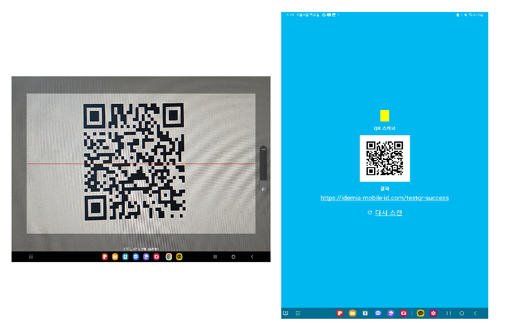

<h1 align="center">
   
  
   
 
</h1>

## Description

A simple QR scanner made as a toy project

## Purpose of production

Simple QR example using the zxing library

## Getting Started

### Dependencies

* Android Device or Android Virtual Emulator
* Kotlin
* Android studio

## Technology Stack

* Kotlin
* Android Jetpack UI 
* Zxing Lib

